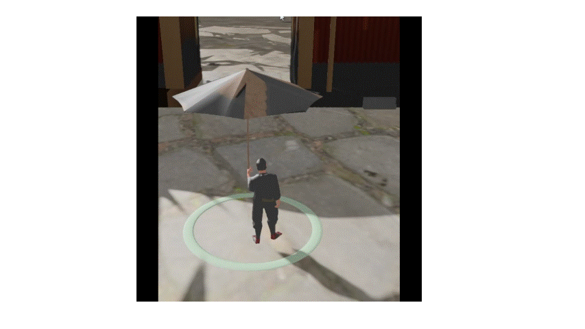
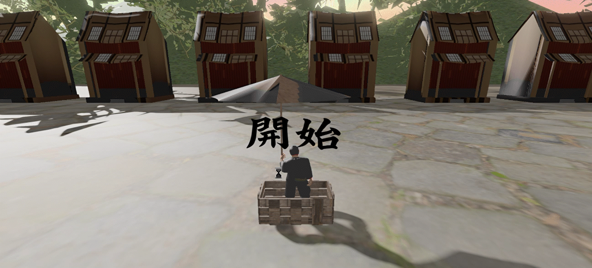

## 　傘廻師

河原電子ビジネス専門学校　ゲームクリエイター科 2年（28卒）

GitHubのURL

https://github.com/MinoYasuhiro/KurukuruDaidougei

YoutubeのURL

https://youtu.be/vFspM1WKWlU?si=FeEYZufL00zf0ORD

## 目次

- [作品概要](#作品概要)
- [傘廻師](#傘廻師)
- [ゲーム説明](#ゲーム説明)
- [技術紹介](#技術紹介)

- [こだわり](#このゲームの醍醐味)
- [技術紹介](#技術紹介)

## 作品概要

タイトル
傘廻師

制作人数：
3人

製作期間：
2026年2月~2026年5月

ゲームジャンル：
3Dアクションゲーム

プレイ人数：
1人

使用言語：

c++

HLSL

使用ツール
Visual studio 2026
Adobe Photoshop 2026
3dsMax 2026
GitHub
fork
MIXAMO

開発環境
K2Engine（学校内製のエンジン）

担当しているもの：

青木
・ゲームシーン、カメラ、ステージ

三野
・Playerの挙動

岡﨑
・UI,BGMとSE,サウンド

担当ソースコード
青木：
background.h/.cpp
Game.h/.cpp
Title.h/.cpp
GameCleaer.h/.cpp
GameOver.h/.cpp
Pause.h/.cpp
SoundOption.h/.cpp
BGMManager.h/.cpp
GameCamera.h/.cpp
Game.h/.cpp

岡﨑：
BGM.h/.cpp
BUttonType.h/.cpp
BallState.h/.cpp
Circle.h/.cpp
CoinBOx.h/.cpp
CoinEffect.h/.cpp
Item.h/.cpp
ItemSpawm.h/.cpp
MenuUI.h/.cpp
QTEbutton.h/.cpp
SE.h/.cpp
SEManager.h/.cpp
SoundSettings.h/.cpp
SoundUI.h/.cpp

三野:
Player.h/.cpp
Umbrella.h/.cpp

## ゲーム説明

ゲーム詳細：

傘回しで、観客を盛り上げて、投げ銭を集めるゲームです。
時間内に指定の回数回せたら傘回しを成功することが目的です。

アイテムの種類は鞠、卵の二種類です

 

プレイヤーについて
・スティックの回転
Lスティックをぐるぐる回すことで傘が回ります
・傾き
Rスティックを動かすと傘のバランスをとることができます。

サウンド設定画面
カーソルがあっている項目のアイコンを拡大表示させました。
もともと拡大表示のみでしたが、カーソルを合わせ、選択したとき傘のアイコンが閉じているものから開いているものに切り替わるようにし、ユーザーが迷わず直感的に操作できる画面にしました。

-1.gif>)

## このゲームの醍醐味：

本作の醍醐味は、観客を盛り上げながら投げ銭を集めていく達成感と、直感的な操作の気持ちよさにあります。
アナログスティックを実際に回すことで傘が回転し、その動きがダイレクトにゲーム内で再現されるため、プレイヤーは「自分で回している感覚」を強く体験できます。
さらに、右スティックによるバランス操作を同時に行うことで、
「勢いよく回す」と「崩さず支える」という2つの操作が求められ、シンプルながらも奥深いプレイ体験になっています。

他にもサウンドオプション画面で、音量調整をするときに傘のマークが開いたりする小ネタも搭載されています。

## 技術紹介

・音量設定の保存 
担当者：岡﨑
本機能では、音量設定をファイルに保存し、読み込む仕組みです。(std::ofstream/std::ifstream)を利用し、バイナリ形式でデータを保存しています。

実装内容

1 設定したものを保存します

void SoundSettings::Save()
{
	//バイナリ形式でファイルを開く
	//ofstream→ファイルに書き込む
	std::ofstream ofs("SoundSettings.dat", std::ios::binary);

	//各音量を順番に書き込む
	ofs.write((char*)&Master, sizeof(float));
	ofs.write((char*)&BGM, sizeof(float));
	ofs.write((char*)&SE, sizeof(float));
}
　　
	
2 保存した設定を読み込みます。

void SoundSettings::Load()
{
	//ファイルを開く
	//ifstream→ファイルから読み込む
	std::ifstream ifs("SoundSettings.dat", std::ios::binary);

	//ファイルが存在しなければ何もしない
	if (!ifs)return;

	//保存された音量を読み込む
	ifs.read((char*)&Master, sizeof(float));
	ifs.read((char*)&BGM, sizeof(float));
	ifs.read((char*)&SE, sizeof(float));
}

この実装により、ゲームを閉じても、設定した音量はカクつかないようにしたときも設定した音量のまま始められます。

・カメラの補間イージング
担当者：青木
カメラ移動時に自然な動きを実現するために、補間にイージング（EaseInOutCubic）を導入しました。
通常の線形補間では一定速度で移動するため機械的な動きになりますが、本処理では開始時と終了時に加減速をつけることで、より滑らかで違和感のないカメラ挙動を実現しています。

実装内容

float GameCamera::EaseInOutCubic(float t)
{

    return (t < 0.5f)
        ? 4.0f * t * t * t
        : 1.0f - powf(-2.0f * t + 2.0f, 3.0f) * 0.5f;	
}

動き始めと終わりは徐々に加速して、減速します。

・傘回しの回転入力の解析
担当者：三野
アナログスティックの入力から回転量を算出する処理を実装しました。
現在と前フレームの入力ベクトルを比較し、内積を用いて回転角度を求めています。
また、外積により回転方向（時計回り・反時計回り）を判定し、符号付きの角度として扱っています。
さらに、微小入力による誤動作を防ぐためデッドゾーン処理を導入し、Clampによる数値安定化も行っています。

実装内容

１傘の内積と外積を求めます

   
    // 内積
    float dot = current.x * prev.x + current.y * prev.y;
    dot = Clamp(dot, -1.0f, 1.0f);

    float angle = acosf(dot);

    // 外積（2D）
    float cross = prev.x * current.y - prev.y * current.x;

    if (cross < 0)
    {
        angle = -angle;
    }

スティックの前フレーム入力との変化量から回転を検出するために、内積を用いて回転角度を算出しています。
さらに外積を利用することで、回転方向（時計回り・反時計回り）を判定し、プレイヤーの操作に応じた直感的な回転挙動を実現しています。

